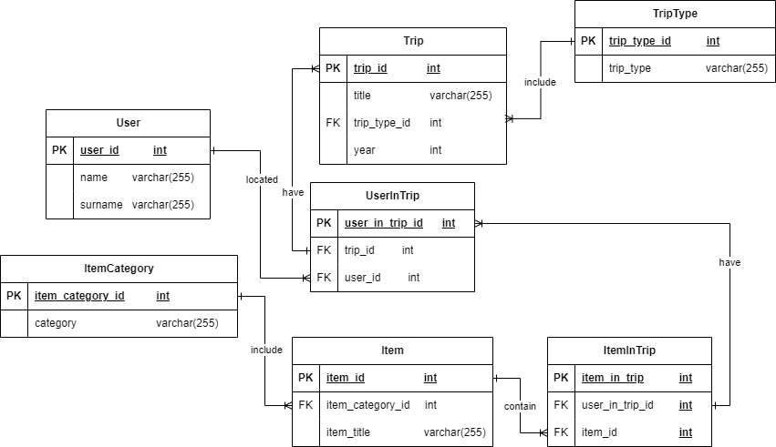

### Лабораторные работы для ГУАП по дисциплине Проектирование Баз Данных

Задания:

1. Спроектировать концептуальную модель предметной области (ER-диаграмму) в соответствии с вариантом задания. Структура модели должна обеспечивать хранение сведений, необходимых для выполнения запросов, указанных в варианте задания. На диаграмме должно быть не менее 3 сущностей. Все сущности должны быть поименованы (уникально в рамках диаграммы) и иметь не менее одного атрибута и у него должен быть проставлен тип данных и задано уникальное в рамках диаграммы имя. Все связи должны быть поименованы, у них должна быть проставлена кратность(1:1, 1:М , М:М) и степень (участвуют ли в связи все или только некоторые экземпляры сущности ).
2. Создать физическую модель базы данных, находящуюся в третьей нормальной форме в
соответствии с заданным вариантом. Расписать ссылочную целостность БД в таблице
3. По аналогии с примерами, приведенными в п. 1 и создать базу данных с разработанной
физической моделью. Продемонстрировать умение добавить и удалить столбец командой alter table
4. По аналогии с примерами, приведенными в п. 1 Выполнить вставку тестовых данных в таблицы,
созданные в ходе выполнения лабораторной работы 2. В строках, вставляемых в таблицы, должны быть
данные как удовлетворяющие, так и не удовлетворяющие условиям запросов, приведенных в варианте
задания. Необходимо привести свои пример использования оператором updateи delete и merge
5. По аналогии с примерами, приведенными в п. 1 и 2 реализовать запросы а) .. в), указанные в
варианте задания. Все запросы должны не содержать вложенных запросов или агрегатных функций.
(Используйте псевдонимы)
6. По аналогии с примерами, приведенными в п. 1 реализовать запросы г) .. ж), указанные в
варианте задания.
Один из запросов на максимум/минимум реализовать с помощью директивы all
Запрос на «все» (реляционное деление) реализовать с помощью 2 not exists
Запросы на разность реализовать в 3 вариантах: Not in,except(MySQL не поддерживает,
поэтому только синтаксис), с использованием левого/правого соединения
7. По аналогии с примерами, приведенными в п. 1 , создать в БД ХП, реализующие:
— вставку с пополнением справочников (вставляется информация о студенте, если указанный номер
группы отсутствует в БД, запись добавляется в таблицу с перечнем групп) (получаем ссылку на
внешний ключ по значению данного из родительской таблицы);
— удаление с очисткой справочников – удаление всех зависимых данных(удаляется информация о
студенте, если в его группе нет больше студентов, запись удаляется из таблицы с перечнем групп);
— каскадное удаление (перед удалением записи о группе удаляются записи обо всех студентах этой
группы);
— вычисление и возврат значения агрегатной функции (т.к. агркгатная функция дает единственный
результат);
— формирование статистики во временной таблице (например, для рассматриваемой БД — для
каждого факультета: количество групп, количество обучающихся студентов, ко-личество изучаемых
дисциплин, количество сданных дисциплин, средний балл по факульте-ту).
8. По аналогии с примерами, приведенными в п. 1 реализовать для своей базы данныхтриггеры
для всех событий (insert,delete,update) до и после. Часть из которых будет обеспечивать ссылочную
целостность, остальные могут иметь другое назначение из 3 предложенных. Вычислимые поля
можно добавить при необходимости.

#### Модель данных



#### Создание базы данных:
```sql
CREATE TABLE Users (
  id SERIAL NOT NULL ,
  name VARCHAR(255) NOT NULL,
  surname VARCHAR(255) NOT NULL,
  PRIMARY KEY (id)
	);


CREATE TABLE TripType (
  id SERIAL NOT NULL ,
  type VARCHAR(255) NOT NULL,
  PRIMARY KEY (id)
);

CREATE TABLE Trip (
  id SERIAL NOT NULL ,
  title VARCHAR(255) NOT NULL,
  year INT NOT NULL,
  type_id INT NOT NULL,
  PRIMARY KEY (id),
  CONSTRAINT fk_Trip_TripType
    FOREIGN KEY (type_id)
    REFERENCES TripType (id)
    ON DELETE RESTRICT
    ON UPDATE CASCADE
);

CREATE TABLE UserInTrip (
  id SERIAL NOT NULL ,
  user_id INT NOT NULL,
  trip_id INT NOT NULL,
  PRIMARY KEY (id),
  CONSTRAINT fk_UserInTrip_User1
    FOREIGN KEY (user_id)
    REFERENCES Users (id)
    ON DELETE CASCADE
    ON UPDATE CASCADE,
  CONSTRAINT fk_UserInTrip_Trip1
    FOREIGN KEY (trip_id)
    REFERENCES Trip (id)
    ON DELETE CASCADE
    ON UPDATE CASCADE);

CREATE TABLE ItemCategory (
  id SERIAL NOT NULL ,
  category VARCHAR(255) NOT NULL,
  PRIMARY KEY (id));

CREATE TABLE Item (
  id SERIAL NOT NULL ,
  title VARCHAR(225) NULL,
  item_category_id INT NOT NULL,
  PRIMARY KEY (id),
  CONSTRAINT fk_Item_ItemCategory1
    FOREIGN KEY (item_category_id)
    REFERENCES ItemCategory (id)
    ON DELETE RESTRICT
    ON UPDATE CASCADE);

CREATE TABLE ItemInTrip (
  id SERIAL NOT NULL ,
  user_in_trip_id INT NOT NULL,
  item_id INT NOT NULL,
  PRIMARY KEY (id),
  CONSTRAINT fk_ItemInTrip_UserInTrip1
    FOREIGN KEY (user_in_trip_id)
    REFERENCES UserInTrip (id)
    ON DELETE CASCADE
    ON UPDATE CASCADE,
  CONSTRAINT fk_ItemInTrip_Item1
    FOREIGN KEY (item_id)
    REFERENCES Item (id)
    ON DELETE CASCADE
    ON UPDATE CASCADE);
```

#### Добавление значений в базу данных

```sql
INSERT INTO itemcategory (category) VALUES
	('одежда'),
	('бытовые предметы'),
	('украшения'),
	('безделушки');
	
INSERT INTO item (title, item_category_id) VALUES
	('очки', 1),
	('перчатки', 1),
	('кольцо', 3),
	('нож', 2);
	
INSERT INTO users ("name", surname) VALUES
	('Иван', 'Сидоров'),
	('Андрей', 'Волков'),
	('Владислав', 'Иванов');
	
INSERT INTO triptype ("type") VALUES
	('поход'),
	('конференция'),
	('культурная');
	
INSERT INTO trip (title, type_id, "year") VALUES
	('музей как архитектурное строение', 2, 2023),
	('прогулка в музей искусств', 3, 2022),
	('поход в лес', 1, 2022),
	('поход от компании "музей"', 1, 2023);
	
INSERT INTO userintrip (trip_id, user_id) VALUES
	(1, 1),
	(1, 2),
	(2, 3),
	(3, 3),
	(4, 1);
	
INSERT INTO itemintrip (item_id, user_in_trip_id) VALUES
	(1, 1),
	(3, 1),
	(1, 2),
	(2, 2),
	(1, 3),
	(1, 4),
	(4, 4),
	(2, 5);
```

#### Найти какие поездки за текущий год имели в названии слово «музей», но не начинаются на него  
```sql
SELECT * FROM trip
WHERE "year" = date_part('year', CURRENT_DATE)
AND title LIKE '%_музей%';
```
#### Найти категорию без предметов 
```sql
SELECT category FROM itemcategory
LEFT JOIN item
ON item.item_category_id = itemcategory.id
WHERE item.item_category_id IS NULL
```
#### Найти в какую поездку брались и очки, и нож 
```sql
SELECT t.title
FROM trip t
INNER JOIN userintrip ut ON t.id = ut.trip_id

INNER JOIN itemintrip it1 ON ut.id = it1.user_in_trip_id
INNER JOIN item i1 ON it1.item_id = i1.id

INNER JOIN itemintrip it2 ON ut.id = it2.user_in_trip_id
INNER JOIN item i2 ON it2.item_id = i2.id
WHERE i1.title = 'нож' AND
i2.title = 'очки' AND
it1.user_in_trip_id = it2.user_in_trip_id; 
```
####Найти пользователя, у которого самая длинная фамилия(или ник в зависимости от того как устроена система) 
```sql
SELECT * FROM Users
WHERE LENGTH(surname) >= ALL (SELECT LENGTH(surname) FROM Users);

SELECT * FROM users
WHERE LENGTH(surname) = (
	SELECT MAX(LENGTH(surname)) FROM users
);
```
#### Какие категории вещей берутся в поездки всех типов 
```sql
Какие категории вещей берутся в поездки всех типов 
SELECT ic.category FROM ItemCategory ic
WHERE NOT EXISTS (
	SELECT * FROM TripType tt
	WHERE NOT EXISTS (
		SELECT * FROM Trip t
		INNER JOIN UserInTrip uit ON uit.trip_id = t.id
		INNER JOIN ItemInTrip iit ON iit.user_in_trip_id = uit.id
		INNER JOIN Item i ON i.id = iit.item_id
		WHERE tt.id = t.type_id AND i.item_category_id = ic.id
	)
);

SELECT ic.category
FROM ItemCategory ic
JOIN Item i ON ic.id = i.item_category_id
JOIN ItemInTrip it ON i.id = it.item_id
JOIN UserInTrip uit ON it.user_in_trip_id = uit.id
JOIN Trip t ON uit.trip_id = t.id
JOIN TripType tt ON t.type_id = tt.id
GROUP BY ic.category
HAVING COUNT(DISTINCT tt.id) = (SELECT COUNT(id) FROM TripType);
```
####Какие категории вещей не берутся в поездку типа «поход», но берутся на конференции 
1) NOT IN
```sql
SELECT ic.category FROM ItemCategory ic
WHERE ic.category NOT IN (
   		SELECT ic.category FROM ItemInTrip iit
		INNER JOIN UserInTrip uit ON iit.user_in_trip_id = uit.id
		INNER JOIN Trip t ON uit.trip_id = t.id
		INNER JOIN TripType tt ON t.type_id = tt.id
		INNER JOIN Item i ON iit.item_id = i.id
		RIGHT JOIN ItemCategory ic ON ic.id = i.item_category_id 
    WHERE tt.type = 'поход' OR
	tt.type IS NULL
) AND ic.category IN (
   		SELECT ic.category FROM ItemInTrip iit
		INNER JOIN UserInTrip uit ON iit.user_in_trip_id = uit.id
		INNER JOIN Trip t ON uit.trip_id = t.id
		INNER JOIN TripType tt ON t.type_id = tt.id
		INNER JOIN Item i ON iit.item_id = i.id
		RIGHT JOIN ItemCategory ic ON ic.id = i.item_category_id 
    WHERE tt.type = 'конференция'
)
```
2) except
```sql
SELECT ic.category FROM ItemCategory ic
INNER JOIN Item i ON ic.id = i.item_category_id
INNER JOIN ItemInTrip it ON i.id = it.item_id
INNER JOIN UserInTrip uit ON it.user_in_trip_id = uit.id
INNER JOIN Trip t ON uit.trip_id = t.id
INNER JOIN TripType tt ON t.type_id = tt.id
WHERE tt.type = 'конференция'

EXCEPT

SELECT ic.category FROM ItemCategory ic
INNER JOIN Item i ON ic.id = i.item_category_id
INNER JOIN ItemInTrip it ON i.id = it.item_id
INNER JOIN UserInTrip uit ON it.user_in_trip_id = uit.id
INNER JOIN Trip t ON uit.trip_id = t.id
INNER JOIN TripType tt ON t.type_id = tt.id
WHERE tt.type = 'поход';
```
3) left-right join
```sql
SELECT *
FROM (SELECT ic.* FROM ItemCategory ic
INNER JOIN Item i ON ic.id = i.item_category_id
INNER JOIN ItemInTrip it ON i.id = it.item_id
INNER JOIN UserInTrip uit ON it.user_in_trip_id = uit.id
INNER JOIN Trip t ON uit.trip_id = t.id
INNER JOIN TripType tt ON t.type_id = tt.id
	  WHERE tt.type = 'поход') as ic1
RIGHT JOIN (
SELECT ic.*
FROM ItemCategory ic
INNER JOIN Item i ON ic.id = i.item_category_id
INNER JOIN ItemInTrip it ON i.id = it.item_id
INNER JOIN UserInTrip uit ON it.user_in_trip_id = uit.id
INNER JOIN Trip t ON uit.trip_id = t.id
INNER JOIN TripType tt ON t.type_id = tt.id
WHERE tt.type = 'конференция'
) as ic2 ON ic1.category = ic2.category
WHERE ic1.category IS NULL
```
#### Найти тип(ы) поездок с количеством поездок, меньше среднего
```sql
WITH
grouping_trips as (
	SELECT count(t.id) as count_id, type FROM Trip t
	INNER JOIN TripType tt ON t.type_id = tt.id
	GROUP BY type
)

SELECT type FROM grouping_trips
WHERE count_id < (SELECT AVG(count_id) FROM grouping_trips)
```
#### Вставка с пополнением справочников
```sql
CREATE OR REPLACE PROCEDURE insert_into_userintrip(
    user_name VARCHAR(255),
    user_surname VARCHAR(255),
    trip_title VARCHAR(255),
    trip_year INT,
    trip_type VARCHAR(255)
)
LANGUAGE plpgsql
AS $$
DECLARE
    user_id_new INT;
    trip_type_id_new INT;
    trip_id_new INT;
BEGIN
    -- user
    IF exists(SELECT * FROM Users WHERE name = user_name AND surname = user_surname) THEN
        SELECT id INTO user_id_new
    	FROM Users
    	WHERE name = user_name AND surname = user_surname;
	ELSE BEGIN
		INSERT INTO Users (name, surname)
        VALUES (user_name, user_surname)
        RETURNING id INTO user_id_new;
	END;
    END IF;

    -- triptype
    IF exists(SELECT * FROM TripType WHERE type = trip_type) THEN
		SELECT id INTO trip_type_id_new
		FROM TripType
		WHERE type = trip_type;
	ELSE BEGIN
		INSERT INTO TripType (type)
        VALUES (trip_type)
        RETURNING id INTO trip_type_id_new;
	END;
    END IF;

    -- trip
    IF exists(SELECT * FROM Trip WHERE title = trip_title AND year = trip_year AND type_id = trip_type_id_new) THEN
		SELECT id INTO trip_id_new
    	FROM Trip
    	WHERE title = trip_title AND year = trip_year AND type_id = trip_type_id_new;
	ELSE BEGIN
		INSERT INTO Trip (title, year, type_id)
        VALUES (trip_title, trip_year, trip_type_id_new)
        RETURNING id INTO trip_id_new;
	END;
    END IF;

    -- userintrip
    INSERT INTO UserInTrip (user_id, trip_id)
    VALUES (user_id_new, trip_id_new);
END;
$$;

call insert_into_userintrip('Пётр', 'Никифоров', 'поход около музея', 2022, 'прогулка')
```
#### Удаление с очисткой справочников
```sql
CREATE OR REPLACE PROCEDURE clear_trip_with_triptype(
    trip_id INT
)
LANGUAGE plpgsql
AS $$
DECLARE
    trip_type_id INT;
BEGIN
  SELECT type_id INTO trip_type_id FROM Trip WHERE id = trip_id;
  
  DELETE FROM Trip WHERE id = trip_id;

  IF NOT EXISTS (SELECT * FROM Trip WHERE type_id = trip_type_id) THEN
    DELETE FROM TripType WHERE id = trip_type_id;
  END IF;
END;
$$;

call clear_trip_with_triptype(5);
```
#### Каскадное удаление
```sql
CREATE OR REPLACE PROCEDURE cascade_user(
    cascade_user_id INT
)
LANGUAGE plpgsql
AS $$
DECLARE
    trip_type_id INT;
BEGIN
  DELETE FROM ItemInTrip
  WHERE user_in_trip_id IN (
    SELECT id FROM UserInTrip uit WHERE user_id = cascade_user_id
  );

  DELETE FROM UserInTrip WHERE user_id = cascade_user_id;

  DELETE FROM Users WHERE id = cascade_user_id;
END;
$$;

call cascade_user(4);
```
#### Вычисление и возврат значения агрегатной функции
```sql
CREATE OR REPLACE FUNCTION users_count() RETURNS INTEGER AS $$
DECLARE
  user_count INTEGER;
BEGIN
	SELECT COUNT(*) INTO user_count FROM Users;

	RETURN user_count;
END;
$$ LANGUAGE plpgsql;

SELECT users_count();


-- Как процедура:

CREATE OR REPLACE PROCEDURE users_count_like_procedure(
	out users_count INTEGER
) AS $$
BEGIN
	SELECT COUNT(*) INTO users_count FROM Users;
END;
$$ LANGUAGE plpgsql;

call users_count_like_procedure(NULL);
```
####Создание таблицы со статистикой
```sql
CREATE OR REPLACE FUNCTION generate_user_statistic()
RETURNS TABLE (
  id INT,
  username VARCHAR(255),
  trip_count INT,
  trip_percent NUMERIC
) AS $$
DECLARE
  all_trip_count INT;
BEGIN
  CREATE TEMPORARY TABLE IF NOT EXISTS UserStatisctic (
    user_id INT,
    user_name VARCHAR(255),
    trip_count INT DEFAULT 0,
    trip_percent NUMERIC DEFAULT 0
  );

  -- заполнение строк id и ФИ пользователя
  INSERT INTO UserStatisctic (user_id, user_name)
  SELECT u.id, u.name || ' ' || u.surname FROM Users u;

  -- Добавление количества 
  UPDATE UserStatisctic
  SET trip_count = us.trip_count
  FROM (
    SELECT user_id, COUNT(trip.id) AS trip_count FROM UserInTrip
    INNER JOIN Trip ON UserInTrip.trip_id = Trip.id
    GROUP BY user_id
  ) AS us
  WHERE UserStatisctic.user_id = us.user_id;

  -- Получение количества поездок
  SELECT SUM(us.trip_count) INTO all_trip_count FROM UserStatisctic us;

  -- Заполнение статистикой
  UPDATE UserStatisctic
  SET trip_percent = COALESCE((UserStatisctic.trip_count::NUMERIC / NULLIF(all_trip_count, 0) * 100), 0)::NUMERIC(4,2);

  -- Возврат таблицы из функции
  RETURN QUERY SELECT * FROM UserStatisctic;

  -- Удаление временной таблицы
  DROP TABLE IF EXISTS UserStatisctic;
END;
$$ LANGUAGE plpgsql;

SELECT * FROM generate_user_statistic();
```
####INSERT BEFORE
```sql
DROP TRIGGER IF EXISTS validate_insert_trip_triger ON Trip;
DROP FUNCTION IF EXISTS validate_insert_trip();

CREATE OR REPLACE FUNCTION validate_insert_trip()
RETURNS TRIGGER AS $$
BEGIN

IF NEW.year < 1900 THEN
RAISE EXCEPTION 'Invalid year';
END IF;

IF NOT EXISTS ( SELECT * FROM TripType WHERE id = NEW.type_id) THEN
RAISE EXCEPTION 'нет такого triptype';
END IF;
  
RETURN NEW;
END;
$$ LANGUAGE plpgsql;


CREATE TRIGGER validate_insert_trip_triger
BEFORE INSERT ON trip
FOR EACH ROW
EXECUTE FUNCTION validate_insert_trip();
```
####INSERT AFTER
```sql
DROP TABLE IF EXISTS Logs;
CREATE TABLE Logs (
	id SERIAL NOT NULL,
	target_id INT NOT NULL,
	target_table VARCHAR(255) NOT NULL,
	operation_type VARCHAR(255) NOT NULL,
	operation_time TIMESTAMP DEFAULT CURRENT_TIMESTAMP,
	PRIMARY KEY (id)
);
DROP TRIGGER IF EXISTS log_inserted_trip_triger ON Trip;
DROP FUNCTION IF EXISTS log_inserted_trip();

CREATE OR REPLACE FUNCTION log_inserted_trip()
RETURNS TRIGGER AS $$
BEGIN
  INSERT INTO Logs (target_id, target_table, operation_type, operation_time)
  VALUES (NEW.id, 'trip', 'INSERT', CURRENT_TIMESTAMP);
  
  RETURN NEW;
END;
$$ LANGUAGE plpgsql;

CREATE TRIGGER log_inserted_trip_triger
AFTER INSERT ON Trip
FOR EACH ROW
EXECUTE FUNCTION log_inserted_trip();
```
#### UPDATE BEFORE
```sql
CREATE OR REPLACE FUNCTION check_having_trip_type()
RETURNS TRIGGER AS $$
BEGIN
  IF NOT EXISTS(SELECT * FROM TripType WHERE id = NEW.type_id) THEN
    RAISE EXCEPTION 'Invalid trip type';
  END IF;

  RETURN NEW;
END;
$$ LANGUAGE plpgsql;


CREATE TRIGGER check_having_trip_type_trigger
BEFORE UPDATE ON Trip
FOR EACH ROW
EXECUTE FUNCTION check_having_trip_type();
```
#### UPDATE AFTER
```sql
CREATE TABLE Logs (
	id SERIAL NOT NULL,
	target_id INT NOT NULL,
	target_table VARCHAR(255) NOT NULL,
	operation_type VARCHAR(255) NOT NULL,
	operation_time TIMESTAMP DEFAULT CURRENT_TIMESTAMP,
	PRIMARY KEY (id)
);
CREATE TABLE TripModifi (
	id SERIAL NOT NULL ,
	title VARCHAR(255) NOT NULL,
	year INT NOT NULL,
	type_id INT NOT NULL
);

DROP TRIGGER IF EXISTS log_updated_trip_triger ON Trip;
DROP FUNCTION IF EXISTS log_updated_trip();

CREATE OR REPLACE FUNCTION log_updated_trip()
RETURNS TRIGGER AS $$
BEGIN
	INSERT INTO Logs (target_id, target_table, operation_type, operation_time)
	VALUES (NEW.id, 'trip', 'UPDATE', CURRENT_TIMESTAMP);
	
	INSERT INTO TripModifi ("id", title, "year", "type_id")
	VALUES (OLD."id", OLD.title, OLD."year", OLD."type_id");
  
	RETURN NEW;
END;
$$ LANGUAGE plpgsql;

CREATE TRIGGER log_updated_trip_triger
AFTER UPDATE ON Trip
FOR EACH ROW
EXECUTE FUNCTION log_updated_trip();
```
#### DELETE BEFORE
```sql
DROP TRIGGER IF EXISTS prevent_delete_trip_trigger ON Trip;
DROP FUNCTION IF EXISTS prevent_delete_trip();

CREATE OR REPLACE FUNCTION prevent_delete_trip()
RETURNS TRIGGER AS $$
BEGIN
	IF EXISTS (SELECT * FROM UserInTrip WHERE trip_id = OLD.id) THEN
		RAISE EXCEPTION 'trip используется в UserInTrip';
	END IF;

	RETURN OLD;
END;
$$ LANGUAGE plpgsql;

CREATE TRIGGER prevent_delete_trip_trigger
BEFORE DELETE ON Trip
FOR EACH ROW
EXECUTE FUNCTION prevent_delete_trip();
```
#### DELETE AFTER
```sql
DROP TRIGGER IF EXISTS clear_trip_trigger ON Trip;
DROP FUNCTION IF EXISTS clear_trip();

CREATE OR REPLACE FUNCTION clear_trip()
RETURNS TRIGGER AS $$
BEGIN
	IF NOT EXISTS (SELECT * FROM Trip WHERE type_id = OLD.type_id) THEN
		DELETE FROM TripType WHERE id = OLD.type_id;
	END IF;
	
	INSERT INTO Logs (target_id, target_table, operation_type, operation_time)
	VALUES (OLD.id, 'trip', 'DELETE', CURRENT_TIMESTAMP);
	
	INSERT INTO TripModifi ("id", title, "year", "type_id")
	VALUES (OLD."id", OLD.title, OLD."year", OLD."type_id");

	RETURN OLD;
END;
$$ LANGUAGE plpgsql;

CREATE TRIGGER clear_trip_trigger
AFTER DELETE ON Trip
FOR EACH ROW
EXECUTE FUNCTION clear_trip();
```